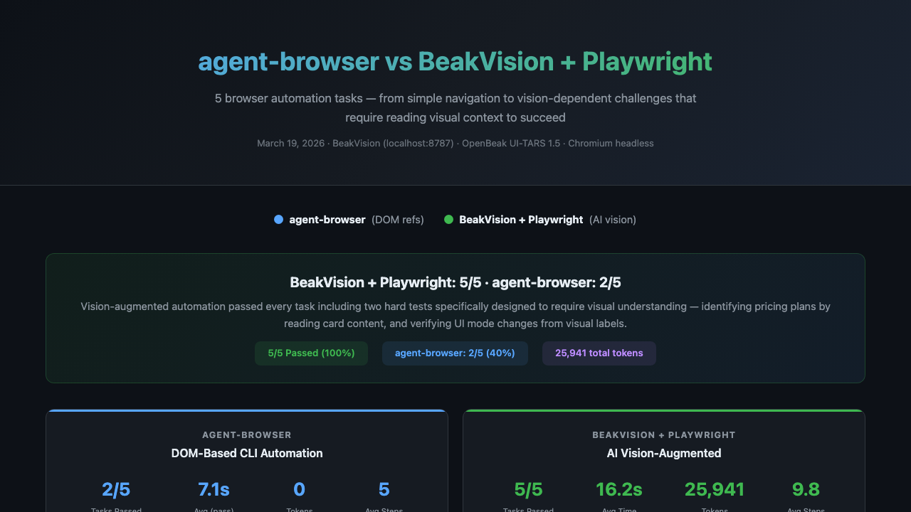
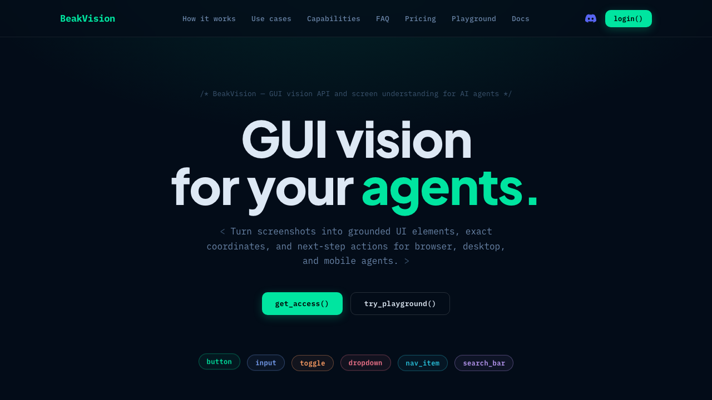
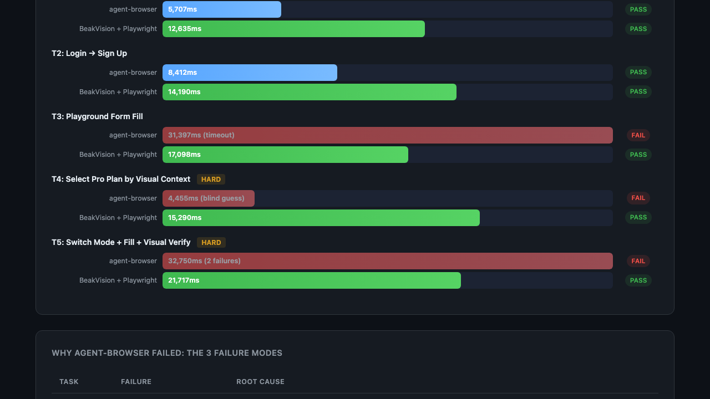
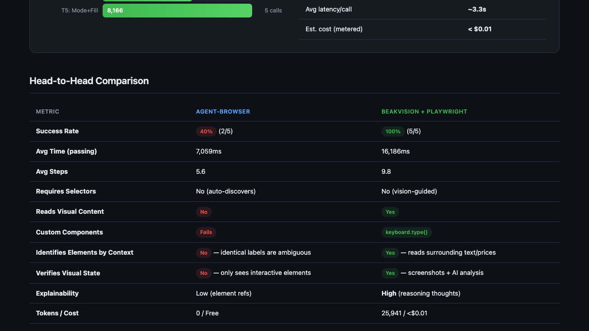
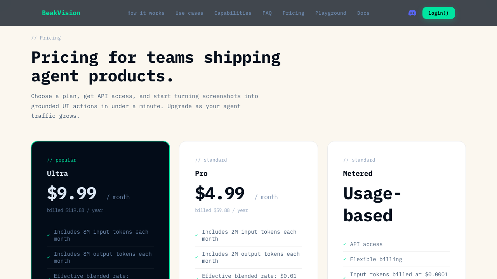
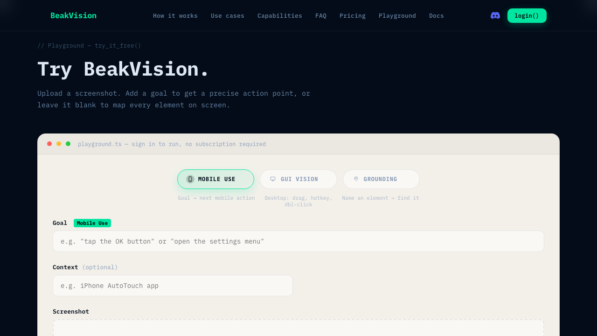

# BeakVision + Playwright: AI-Powered Browser Automation

An intelligent browser automation skill that combines **OpenBeak's GUI Vision API** with **Playwright** to complete complex web tasks. The agent sees pages through screenshots, reasons about what to do using AI vision, and acts using Playwright's low-level browser APIs.



## How It Works

```
Screenshot → OpenBeak /v1/parse → Action + Reasoning → Playwright executes → Repeat
```

1. Playwright navigates to a page and takes a screenshot
2. The screenshot is sent to OpenBeak's vision API with a goal description
3. OpenBeak returns the next action (click, type, scroll) with pixel coordinates and reasoning
4. Playwright executes the action using `mouse.click()` and `keyboard.type()`
5. The loop repeats until the task is complete



## Benchmark: BeakVision + Playwright vs agent-browser

We benchmarked 5 tasks against agent-browser (a DOM-based CLI tool). Two tasks were specifically designed to require visual understanding.



### Results

| Task | agent-browser | BeakVision + Playwright |
|------|:---:|:---:|
| T1: Navigate to Pricing | PASS (5.7s) | PASS (12.6s) |
| T2: Login -> Sign Up | PASS (8.4s) | PASS (14.2s) |
| T3: Playground Form Fill | **FAIL** (31.4s timeout) | PASS (17.1s) |
| T4: Select Pro Plan (HARD) | **FAIL** (blind guess) | PASS (15.3s) |
| T5: Mode Switch + Fill + Verify (HARD) | **FAIL** (2 failures) | PASS (21.7s) |
| **Total** | **2/5 (40%)** | **5/5 (100%)** |

### Why agent-browser Failed



**T3 - Custom React Input**: agent-browser's `fill` command timed out after 25 seconds. The playground's Goal input is a custom React component that doesn't respond to standard Playwright fill events. BeakVision used vision-guided `mouse.click()` + `keyboard.type()` to bypass it.

**T4 - Identical Buttons (the killer test)**: The pricing page has three plan cards (Ultra, Pro, Metered), each with a `get_access()` button. In the DOM, all three buttons are identical:

```
button "get_access()" [ref=e12]
button "get_access()" [ref=e13] [nth=1]
button "get_access()" [ref=e14] [nth=2]
```

agent-browser has **zero way** to know which plan each button belongs to — the plan names (Ultra, Pro, Metered) and prices ($9.99, $4.99) are non-interactive text invisible to `snapshot -i`. It can only blind-guess by index.

BeakVision read the screenshot, identified "$4.99/month" and "Pro" visually, and clicked the correct button:

> *"I noticed three 'get_access' buttons. The Pro plan costs $4.99/month, displayed in the middle. Its button is right below the Pro card."*



**T5 - Visual State Verification**: After switching from "Mobile Use" to "Grounding" mode, the UI shows a green badge labeled "Grounding" next to the Goal field. This badge is a non-interactive visual element — `snapshot -i` can't see it. agent-browser clicked the tab but couldn't verify the mode actually changed. Plus the same custom input failure as T3.

BeakVision confirmed the state change visually:

> *"The page has switched to Grounding mode. There is a green badge labeled 'Grounding' near the Goal input field. The mode switch was successful."*



### Performance Comparison

| Metric | agent-browser | BeakVision + Playwright |
|--------|:---:|:---:|
| Success Rate | 40% (2/5) | **100% (5/5)** |
| Avg Time (passing) | 7.1s | 16.2s |
| Avg Steps | 5.6 | 9.8 |
| Total Tokens | 0 | 25,941 |
| Est. Cost | Free | < $0.01 |
| Reads Visual Content | No | **Yes** |
| Custom Components | Fails | **keyboard.type()** |
| Visual Verification | No | **Yes** |
| Explainability | Low | **High** (reasoning thoughts) |

### Capability Matrix

| Capability | agent-browser | BeakVision + PW |
|------------|:---:|:---:|
| Element Discovery | 4/5 | 5/5 |
| Execution Speed | 5/5 | 3/5 |
| Unknown UI Adaptability | 3/5 | 5/5 |
| Visual Context Understanding | 0/5 | 5/5 |
| Custom Component Handling | 2/5 | 5/5 |
| Multi-Page Workflows | 4/5 | 5/5 |
| Visual State Verification | 0/5 | 5/5 |
| Error Recovery | 2/5 | 4/5 |

## Quick Start

### Prerequisites

```bash
pip install playwright
python -m playwright install chromium
```

### Usage

```python
import json, base64, urllib.request
from playwright.sync_api import sync_playwright

OPENBEAK_URL = "https://vision.openbeak.ai/v1/parse"
API_KEY = os.environ.get("OPENBEAK_API_KEY", "")

def openbeak_analyze(image_path, goal, mode="computer"):
    with open(image_path, "rb") as f:
        image_b64 = base64.b64encode(f.read()).decode("utf-8")
    payload = json.dumps({"image": image_b64, "mode": mode, "goal": goal}).encode()
    req = urllib.request.Request(OPENBEAK_URL, data=payload, headers={
        "Authorization": f"Bearer {API_KEY}",
        "Content-Type": "application/json",
    }, method="POST")
    with urllib.request.urlopen(req, timeout=45) as resp:
        return json.loads(resp.read().decode("utf-8"))

with sync_playwright() as p:
    browser = p.chromium.launch(headless=True)
    page = browser.new_page(viewport={"width": 1280, "height": 720})

    page.goto("https://example.com")
    page.wait_for_load_state("networkidle")
    page.screenshot(path="/tmp/step.png")

    result = openbeak_analyze("/tmp/step.png", "Click the Sign Up button")
    action = result["data"]["action"]
    print(f"Thought: {action['thought']}")

    page.mouse.click(action["point"]["x"], action["point"]["y"])
    browser.close()
```

### Key Rule: Always use `keyboard.type()` for text input

```python
# DON'T - fails on custom components
page.fill("input", "text")

# DO - works everywhere
page.mouse.click(x, y)          # click at OpenBeak coordinates
page.wait_for_timeout(300)
page.keyboard.type("text", delay=20)  # individual keystrokes
```

### Helper Script

```bash
python scripts/analyze.py --image screenshot.png --goal "Click submit" --mode computer
```

## OpenBeak API

**Endpoint**: `POST /v1/parse`

**Modes**:
- `computer` - Desktop/browser screenshots (click, type, scroll, hotkey, drag)
- `mobile` - Mobile viewports (click, long_press, type, scroll)
- `ground` - Quick element localization by name (coordinates only, no reasoning)

**Response** includes:
- `action.type` - What to do
- `action.point` - Where (x, y coordinates)
- `action.thought` - Why (AI reasoning)
- `elements[]` - All detected UI elements with bounding boxes
- `screen_description` - What the AI sees

## Files

```
beakvision-examples/
  SKILL.md              # Claude Code skill definition
  scripts/analyze.py    # OpenBeak API helper script
  benchmark.html        # Interactive benchmark report (open in browser)
  benchmark-results.json # Raw benchmark data
  screenshots/          # Task screenshots
    01-homepage.png
    02-pricing-cards.png
    03-login-page.png
    04-playground.png
    05-benchmark-summary.png
    06-benchmark-chart.png
    07-benchmark-failures.png
```

## Interactive Benchmark Report

Open `benchmark.html` in your browser for the full interactive report with:
- Timing bar charts for all 5 tasks
- Step-by-step execution timelines with OpenBeak's reasoning thoughts
- Failure analysis table
- Token usage and cost breakdown
- Capability matrix
